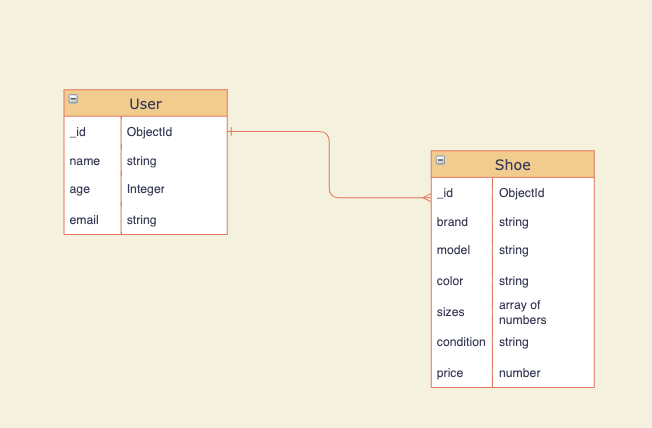

# Sole Mates
### Date: 08/25/21
### By: Sa'man Griffiths, Ryan Craig, and Raza Khalid
---

>## *Description*

Sole Mates is an social media and e-commerce website specifically for shoes (think instagram but just shoe pics). Website can be used to show off your new kicks or discover new styles. Users can also purchase the shoes directly from our site.

---
>## *Technologies Used* 

* Mongodb
* Express.js
* React.js
* Node.js

---

>## *Entity Relationship Diagram*

The database will take in user info as well as the info related to the shoes being posted. Database structure will be denormalized utilizing a one to many relationship connecting a single user to multiple posts. Entries will be connected by a generated objectId. 

---
>## *Component Hierarchy Diagram*

>## *Task List*

- [ ] Design frontend with React.
- [ ] Build routes and controllers using Express. User should be able to perform CRUD operations.
- [ ] Develope a demo database that allows users to post additional entries.
- [ ] Style application into a presentable portfolio piece.
- [ ] Deploy using Heroku.

